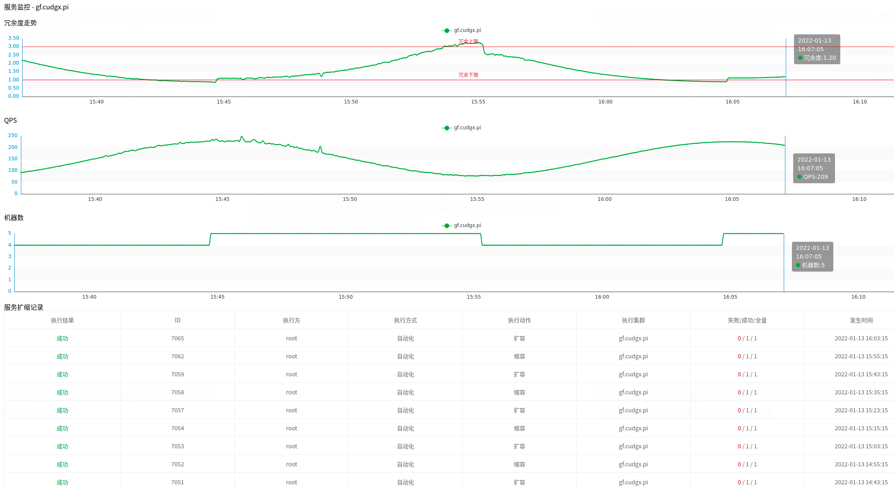

-------

简介
--------

CudgX是星汉未来推出的面向云原生时代的AIOps智能运维引擎，它通过各类服务的多维度、大数据量的数据收集及机器学习训练分析，对各种服务进行指标化、数字化度量，并基于部署的训练模型，对服务质量进行实时度量从而实现对算力、存储、网络等基础资源的自动化、智能化实时动态调度。

主要特性: 
1、支持服务日志记录和聚合计算； 
2、支持自动化压测； 
3、支持实时容量评估； 
4、支持自动化、智能化的算力弹性调度； 
5、提供mesh agent SDK代理接入； 
6、支持Web服务指标的自动化测量，以及自动扩缩容； 
7、开放的指标定义平台，合作伙伴可以基于开放平台进行个性化指标配置； 

联系我们
----
[微博](https://weibo.com/galaxyfuture) | [知乎](https://www.zhihu.com/org/xing-yi-wei-lai) | [B站](https://space.bilibili.com/2057006251)
| [微信公众号](https://github.com/galaxy-future/comandx/blob/main/docs/resource/wechat_official_account.md)
| [企业微信交流群](https://github.com/galaxy-future/comandx/blob/main/docs/resource/wechat.md)

系统架构
--------

* 系统架构图

  

* 系统模块说明
  * cudgx-api：
    * predict-rules： 负责维护扩缩容规则信息。
    * redundancy-keeper： 负责服务集群冗余度保持。
  * cudgx-gateway： 负责收集`metrics-go`上报的打点数据，并将数据分发到Kafka。
  * cudgx-consumer： 负责消费kafka数据，存储至clickhouse。
  * metrics-go： cudgx打点SDK。

系统图例
--------
- 查看服务监控相关图例： `冗余度走势` `QPS` `机器数` 图。
- 查看服务扩缩记录。
- 示例：

    
  

安装部署
--------

1、配置要求

为了系统稳定运行，建议系统型号2核4G内存；CudgX已经在Linux系统以及macOS系统进行了安装和测试。

2、环境依赖

安装CudgX前，请先安装：

 BridgX：请根据[BridgX安装指南](https://github.com/galaxy-future/bridgx/blob/master/README.md) 安装BridgX。要求内网部署环境，能够跟云厂商vpc连通。

 SchedulX： 请根据[SchedulX安装指南](https://github.com/galaxy-future/schedulx/blob/master/README.md) 安装SchedulX。要求内网部署环境，能够跟云厂商vpc连通。

 ComandX： 如果需要进行前端操作，请根据[ComandX安装指南](https://github.com/galaxy-future/comandx/blob/main/README.md) 安装ComandX。

3、安装步骤

* (1)源码下载
    - 后端工程：
  > `git clone https://github.com/galaxy-future/cudgx.git`

* (2)macOS（仅支持intel芯片）系统安装部署
    - 后端部署,在CudgX目录下运行
      > `make docker-run-mac`

* (3)Linux系统安装部署
    - 1）针对使用者
        - 后端部署,在CudgX目录下运行
          > `make docker-run-linux`

    - 2）针对开发者
        - 由于项目会下载所需的必需基础镜像,建议将下载源码放到空间大于10G以上的目录中。
        - 后端部署
            - CudgX依赖mysql & kafka & clickhouse组件，
                - 如果使用内置的mysql & etcd & clickhouse，则进入CudgX根目录，则使用以下命令：
                  > docker-compose up -d    //启动CudgX服务  
                  > docker-compose down    //停止CudgX服务   
                - 如果已经有了外部的mysql & etcd & clickhouse服务，则可以到 `cd conf` 下修改`api.json` `gateway.json` `consumer.json`文件中对应组件的ip和port配置信息,然后进入Cudgx的根目录，使用以下命令:
                  > docker-compose up -d api    //启动api服务  
                  > docker-compose up -d gateway //启动gateway服务  
                  > docker-compose up -d consumer //启动consumer服务  
                  > docker-compose down     //停止CudgX服务

* (4)前端页面
        
  - 如果需要进行前端操作，请安装[ComandX](https://github.com/galaxy-future/comandx/blob/main/README.md)
    - 系统运行后，浏览器输入 `http://127.0.0.1` 可以看到管理控制台界面,初始用户名 root 和密码为123456。

* (5)metrics-go
    - 1）需要将目标应用基于CudgX-SDK [metrics-go](https://github.com/galaxy-future/metrics-go/blob/master/README.md) 埋点，完成打点数据上传。
      我们已经提供了一个sample应用 `cudgx-sample-pi` 用于测试： cudgx-sample-pi 应用已经基于 [metrics-go](https://github.com/galaxy-future/metrics-go/blob/master/README.md) 完成埋点操作。并且docker镜像 `galaxyfuture/cudgx-sample-pi` 已推送至docker hub。
    
    - 2）通过SchedulX完成服务部署，此处参考SchedulX创建服务流程
      - 关键配置：
        - ComandX页面-服务部署-创建扩缩容流程-镜像部署-服务启动命令： 
            > docker run -d -e CUDGX_SERVICE_NAME=test.cudgx.gf -e CUDGX_CLUSTER_NAME=default -e CUDGX_GATEWAY_URL=http://127.0.0.1:8080 -p 80:8090  
        
            环境变量参数说明：   
          - CUDGX_SERVICE_NAME： 服务名称
          - CUDGX_CLUSTER_NAME： 集群名称
          - CUDGX_GATEWAY_URL： CudgX-gateway服务地址

        - ComandX页面-服务部署-创建扩缩容流程-流量接入-配置SLB id： 接入阿里云SLB
  
    - 3）配置扩缩容规则
      
      - 关键配置
        - ComandX页面-服务部署-扩缩容规则

    - 4）向 {SLB IP}:{SLB PORT}/pi 接口施压
        推荐两种方式：
      - a：测试过程中我们提供了 `cudgx-sample-benchmark` 应用，用作模拟访问流量。docker镜像 `galaxyfuture/cudgx-sample-benchmark`， 已推送至docker hub。
        
        > docker run -d --name cudgx_sample_benchmark --network host galaxyfuture/cudgx-sample-benchmark --gf.cudgx.sample.benchmark.sever-address={SLB IP}:{SLB PORT}/pi
            
      - b：借助开源接口测试工具，向 {SLB IP}:{SLB PORT}/pi 接口施压。

    - 5）ComandX页面-服务列表-集群监控
      - 查看服务监控相关图例： `冗余度走势` `QPS` `机器数` 图。
      - 查看服务扩缩记录。     

视频教程
------
[ComandX安装](https://www.bilibili.com/video/BV1n34y167o8/)  
[添加云账户](https://www.bilibili.com/video/BV1Jr4y1S7q4/)   
[创建集群](https://www.bilibili.com/video/BV1Wb4y1v7jw/)    
[手动扩缩容](https://www.bilibili.com/video/BV1bm4y197QD/)   
[K8s集群创建与Pod切割](https://www.bilibili.com/video/BV1FY411p7rE/) 

技术文章
------
[《云原生技术如何每分钟级迁移TB级数据》](https://zhuanlan.zhihu.com/p/442746588) 
[《企业迁移到K8s的最佳实践》](https://zhuanlan.zhihu.com/p/445131885)  
[《来自一线大厂的十大云原生成本优化手段》](https://zhuanlan.zhihu.com/p/448405809) 

行为准则
------
[贡献者公约](https://github.com/galaxy-future/cudgx/blob/master/CODE_OF_CONDUCT.md)

授权
-----

CudgX使用[Elastic License 2.0](https://github.com/galaxy-future/cudgx/blob/master/LICENSE)授权协议进行授权

